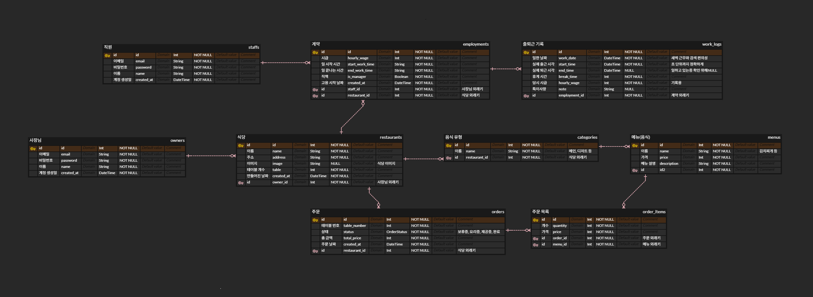

# 🍽️ Restaurant Service Platform    (개발 기간 약 4주)
> **식당 사장님, 손님, 아르바이트 직원을 하나로 잇는 올인원 통합 주문 관리 플랫폼**

<div align="center">
  
  
  
  
  
  
  
  
</div>

<br/>

React(Web), React Native(App), Express(Backend)를 **pnpm Monorepo**로 구성하여 하나의 저장소에서 효율적으로 관리하는 풀스택 프로젝트입니다.

***

## 🏗️ 시스템 아키텍처 (System Architecture)

### 📂 프로젝트 구조 (Monorepo)
*   **`web-client`**: 식당 사장님(관리자) 및 손님(QR 주문)용 웹 애플리케이션 (React + Vite)
*   **`staff-app`**: 매장 직원용 주문 접수 및 서빙 관리 앱 (React Native + Expo)
*   **`backend`**: REST API 서버 및 데이터베이스 관리 (Express + TypeScript + Prisma)
*   **`packages/shared-types`**: 프론트엔드와 백엔드 간 타입 일관성을 위한 공통 타입 정의

### 📊 데이터베이스 설계 (Database Design)
본 프로젝트는 **PostgreSQL**을 사용하며, 다중 점포와 유연한 고용 관계를 지원하도록 설계되었습니다.




#### 핵심 설계 전략
1.  **사용자 분리 (User Segmentation)**
    *   `owners`(사장)와 `staffs`(직원) 테이블을 물리적으로 분리하여 권한 관리의 복잡성을 제거했습니다.
    *   손님은 별도의 회원가입 없이 `orders` 테이블 자체로 비회원 식별이 가능하도록 설계하여 접근성을 높였습니다.

2.  **유연한 고용 관계 (N:M Employment)**
    *   `staffs`와 `restaurants` 사이에 `employments` 중간 테이블을 두어, 한 직원이 여러 식당에서 근무할 수 있는 구조입니다.
    *   각 고용 관계마다 서로 다른 시급(`hourly_wage`)과 직급(`is_manager`)을 가질 수 있습니다.

3.  **데이터 무결성 및 스냅샷 (Data Integrity & Snapshot)**
    *   **급여 정산**: `work_logs`에 근무 당시의 시급(`hourly_wage`)을 스냅샷으로 저장하여, 추후 시급이 인상되어도 과거 급여 계산에 오류가 없도록 했습니다.
    *   **매출 통계**: `order_items`에 주문 당시의 메뉴 가격(`price`)을 저장하여, 메뉴 가격 변동이 과거 매출 리포트에 영향을 주지 않도록 설계했습니다.

***

## 🛠️ 개발 명령어 (Commands)

이 프로젝트는 **pnpm workspace**를 사용합니다. 모든 명령어는 루트 디렉토리에서 실행하는 것을 권장합니다.

### 1. 초기 설정 (Setup)
```bash
# 의존성 설치
pnpm install
```

### 2. 프로젝트 실행 (Run)
```bash
# 모든 프로젝트 동시 실행 (Web + App + Backend)
pnpm -r dev

# 개별 프로젝트 실행
pnpm --filter ./web-client dev       # 웹 클라이언트 실행
pnpm --filter ./backend dev          # 백엔드 서버 실행
pnpm --filter ./staff_app start      # 앱 실행 (Expo Metro Bundler)
# (참고) 앱을 웹 브라우저로 띄우기: pnpm --filter staff-app start --web
```

### 3. 빌드 (Build)
```bash
# 특정 프로젝트 빌드
pnpm --filter ./web-client build
```

### 4. 패키지 설치 (Install Packages)
루트가 아닌 특정 프로젝트에 라이브러리를 설치할 때 사용합니다.
```bash
# 예: 백엔드에 Prisma Client 설치
pnpm --filter ./backend add @prisma/client

# 기본 문법: pnpm --filter ./<프로젝트명> add <라이브러리명>
```

### 5. 데이터베이스 관리 (Prisma)
Prisma 관련 명령어는 `exec`를 사용하여 실행합니다.

```bash
# 5.1 마이그레이션 실행 (테이블 생성 및 변경사항 저장)
# 실제 DB 스키마를 변경하고 migration 히스토리를 생성합니다.
pnpm --filter ./backend exec prisma migrate dev --name init

# 5.2 Prisma Client 생성
# 마이그레이션 후 자동으로 실행되지만, 타입 에러 발생 시 수동 실행을 권장합니다.
pnpm --filter ./backend exec prisma generate

# 5.3 Prisma Studio 실행 (GUI로 DB 데이터 확인)
pnpm --filter ./backend exec prisma studio

# 5.4 스키마 단순 동기화 (프로토타이핑용)
# 마이그레이션 파일 생성 없이 DB 구조만 빠르게 바꿉니다. (주의: 데이터 유실 가능성 있음)
pnpm --filter ./backend exec prisma db push
```
