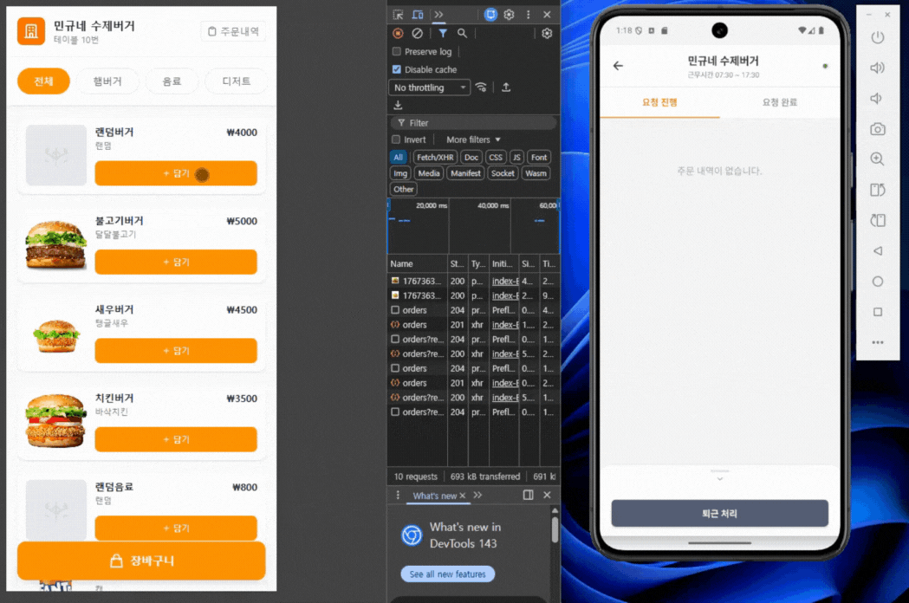
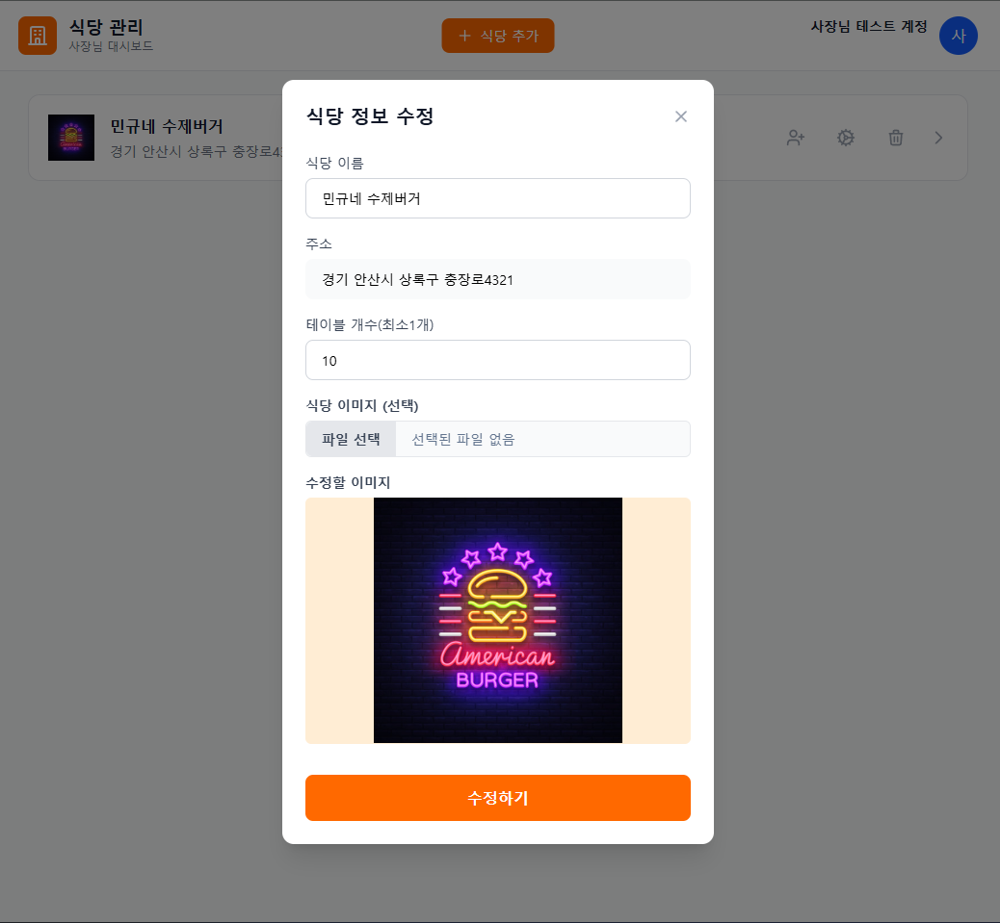
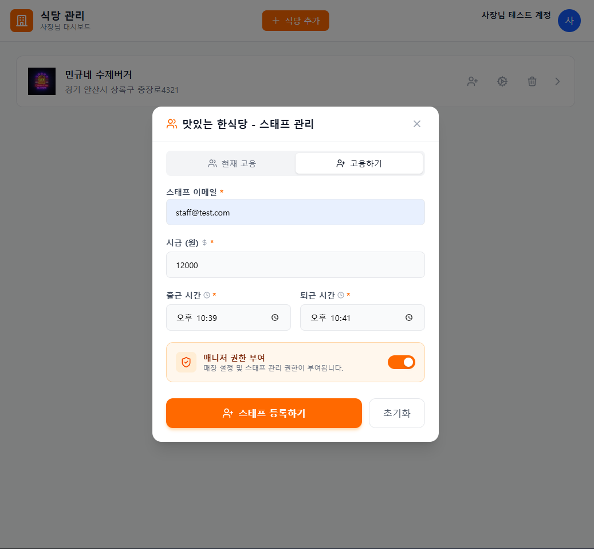
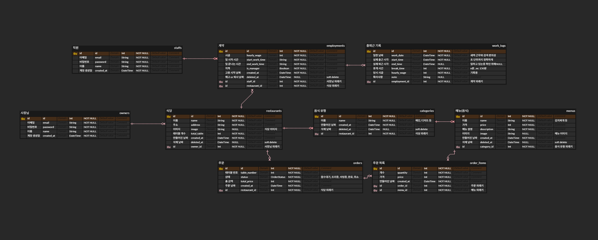

# 🍽️ Restaurant Service Platform (통합 식당 주문 관리 서비스)
> **식당 사장님, 손님, 아르바이트 직원을 하나로 잇는 올인원 통합 주문 관리 플랫폼**

<div align="center">
  
  
  
  
  
  <br/>
  
  
  
  
  
  <br/>
  
  
  
  
  
  
</div>

<br/>

## 💡 프로젝트 배경 (Background)
> **"왜 작은 식당은 효율적인 주문 시스템을 쓰지 못할까?"**

과거 식당 아르바이트를 하며, 디지털 주문 시스템이 없는 환경에서의 비효율(주문 누락, 동선 낭비 등)을 직접 겪었습니다.
고가의 키오스크나 복잡한 시스템 없이도, **사장님은 웹으로 편하게 관리하고 직원은 앱으로 즉시 알림을 받을 수 있는 효율적인 시스템**을 만들고자 이 프로젝트를 시작했습니다.

---

## 🚀 프로젝트 소개 & 핵심 기능 (Key Features)
React(Web), React Native(App), Express(Backend)를 **pnpm Monorepo**로 구성하여 하나의 저장소에서 효율적으로 관리하는 풀스택 프로젝트입니다.
**WebSocket**을 활용하여 웹(주문)과 앱(주방/홀) 간의 **실시간 데이터 동기화**를 구현했습니다.

### 1️⃣ 실시간 주문 연동 (Real-time Order Sync)
손님이 QR코드를 통해 주문페이지에 들어가 주문하면, 주방/홀 직원의 앱에 **지연 없이 즉시 알림**이 도착합니다.
<div align="left">
  
</div>

### 2️⃣ 통합 매장 관리 (Store & Staff Management)
직관적인 UI로 여러 개의 식당을 관리하고, 아르바이트 직원을 간편하게 고용 및 관리할 수 있습니다.

| 매장 정보 관리 | 직원 고용 및 권한 관리 |
| :---: | :---: |
|  |  |

### 3️⃣ 직원 전용 앱 (Staff Mobile App)
직원은 전용 앱을 통해 계약된 매장으로 출근하고, 내 근무 내역을 확인할 수 있습니다.
<div align="left">
  
</div>

---

## 🔗 배포 링크 & 체험 (Live Demo)

> **면접관님을 위한 테스트 계정 (Admin)**
> - **URL:** [https://restaurant-service-platform-web-cli.vercel.app](https://restaurant-service-platform-web-cli.vercel.app)
> - **ID:** `owner@test.com`
> - **PW:** `qwe123!@#`
> - *(미리 세팅된 식당 데이터와 메뉴가 준비되어 있습니다)*

### 📱 손님 주문 체험하기 (QR Code)
아래 QR 코드를 스마트폰 카메라로 스캔하면, 로그인 없이 바로 **주문 페이지**를 체험해보실 수 있습니다.
<div align="left">
  
</div>

---

## 🏗️ 시스템 아키텍처 (System Architecture)

### 📂 프로젝트 구조 (Monorepo)
*   **`web-client`**: 식당 사장님(관리자) 및 손님(QR 주문)용 웹 애플리케이션 (React + Vite, TanStack Query)
*   **`staff_app`**: 매장 직원용 주문 접수 및 서빙 관리 앱 (React Native + Expo)
*   **`backend`**: REST API 서버 및 데이터베이스 관리 (Express + TypeScript + Prisma)
*   **`packages/shared-types`**: 프론트엔드와 백엔드 간 타입 일관성을 위한 공통 타입 정의

### 📊 데이터베이스 설계 (Database Design)
본 프로젝트는 **PostgreSQL**을 사용하며, 다중 점포와 유연한 고용 관계를 지원하도록 설계되었습니다.

<div align="left">
  
</div>

#### 핵심 설계 전략
1.  **사용자 분리 (User Segmentation)**
    *   `owners`(사장)와 `staffs`(직원) 테이블을 물리적으로 분리하여 권한 관리의 복잡성을 제거했습니다.
    *   손님은 별도의 회원가입 없이 `orders` 테이블 자체로 비회원 식별이 가능하도록 설계하여 접근성을 높였습니다.

2.  **데이터 안전성 (Soft Delete)**
    *   주문정보나 고용기록 정보 등 중요한 데이터는 추후 활용 및 기록성으로 남기고 있도록 **Soft Delete(논리적 삭제)** 방식을 적용했습니다.
    *   `deletedAt` 필드를 활용하여 데이터의 이력을 보존하고 참조 무결성을 유지했습니다.

3.  **유연한 고용 관계 (N:M Employment)**
    *   `staffs`와 `restaurants` 사이에 `employments` 중간 테이블을 두어, 한 직원이 여러 식당에서 근무할 수 있는 구조입니다.
    *   각 고용 관계마다 서로 다른 시급(`hourly_wage`)과 직급(`is_manager`)을 가질 수 있습니다.

4.  **데이터 무결성 및 스냅샷 (Data Integrity & Snapshot)**
    *   **급여 정산**: `work_logs`에 근무 당시의 시급(`hourly_wage`)을 스냅샷으로 저장하여, 추후 시급이 인상되어도 과거 급여 계산에 오류가 없도록 했습니다.
    *   **매출 통계**: `order_items`에 주문 당시의 메뉴 가격(`price`)을 저장하여, 메뉴 가격 변동이 과거 매출 리포트에 영향을 주지 않도록 설계했습니다.

---

## 🧪 테스트 및 안정성 (Testing & Reliability)
서비스의 안정적인 운영과 배포 전 기능 검증을 위해 **Jest**와 **Supertest**를 활용한 통합 테스트 환경을 구축했습니다.

### 🛡️ 통합 테스트 (Integration Test)
*   **API 시나리오 검증:** 실제 DB(Prisma)와 연동하여 `식당 생성 -> 수정 -> 조회 -> 폐업(Soft Delete)`으로 이어지는 전체 라이프사이클을 테스트합니다.
*   **보안 검증:** `JWT` 인증 미들웨어와 연동하여, 유효하지 않은 토큰이나 권한 없는 접근(403 Forbidden)을 사전에 차단하는지 검증합니다.
*   **환경 격리:** 테스트 실행 시 전용 환경변수와 트랜잭션 롤백(또는 데이터 초기화)을 적용하여, 로컬 개발 데이터에 영향을 주지 않도록 설계했습니다.

---

## 🔧 트러블슈팅 (Troubleshooting)
개발 과정에서 겪은 주요 기술적 이슈와 해결 과정입니다.

### 1. Docker 환경에서 NODE_ENV 적용 안 되는 문제
로컬(Windows)과 배포 서버(Linux/Docker) 환경 차이로 인해 S3 업로드 경로가 꼬이는 문제가 있었습니다. 로컬에서는 `dev/` 폴더로 잘 업로드되었지만, EC2 배포 후에도 계속 `dev/` 경로로 저장되는 현상이 발생했습니다.

원인은 Docker 컨테이너에 `NODE_ENV` 환경 변수가 제대로 전달되지 않았기 때문이었고, `docker-compose.yml` 파일에 아래처럼 명시적으로 변수를 선언하여 해결했습니다.

**해결**
*   `docker-compose.yml`의 `backend` 서비스에 명시적으로 환경 변수 추가:
    ```yaml
    environment:
      NODE_ENV: production
    ```

### 2. 보안 이슈 (Mixed Content 및 HTTPS 적용)
프론트엔드를 Vercel(HTTPS 기본)로 배포한 후, AWS EC2(HTTP) 백엔드 서버로 API 요청을 보냈으나 브라우저의 **Mixed Content(혼합 콘텐츠) 보안 정책**에 의해 통신이 차단되는 문제가 발생했습니다.

**해결**
*   **도메인 연결:** Gabia에서 도메인을 구매하여 EC2 탄력적 IP(Elastic IP)와 연결
*   **Nginx**와 **Certbot**을 설치하여 무료 보안 인증서(SSL)를 적용했고, 백엔드 주소를 `https://food-manager.shop`으로 변경해 통신이 정상적으로 되도록 만들었습니다.

---

## 💭 회고 (Retrospective)

### 1. 프로젝트 선정 이유와 목표
기존 식당 아르바이트 경험에서 느꼈던 **파편화된 주문 시스템(태블릿, 키오스크, QR 등)의 비효율**을 해결해보고자 했습니다. 사장님과 직원, 손님을 하나의 생태계로 묶는 **'통합 관리 플랫폼'**을 목표로 기획부터 배포까지 전 과정을 주도했습니다.

### 2. 기술 선정과 도전 (Why these technologies?)
**"익숙함에 안주하지 않고, 새로운 기술 생태계를 경험하자"**는 목표로 기술 스택을 선정했습니다.
*   **React & React Native:** 기존 Vue/Flutter 경험을 넘어, 가장 거대한 프론트엔드 생태계를 직접 경험해보고자 채택했습니다. 웹과 앱 간의 코드 및 로직 공유 가능성을 탐구했습니다.
*   **Express & TypeScript:** 프론트엔드와 언어를 통일(TypeScript)하여 생산성을 높이고, 대규모 커뮤니티의 지원을 받을 수 있는 안정적인 프레임워크를 선택했습니다.
*   **Monorepo:** 웹, 앱, 백엔드 3개의 프로젝트를 효율적으로 관리하기 위해 도입했습니다.

### 3. 모노레포 도입에 대한 고찰
**[좋았던 점]**
하나의 저장소에서 `packages/shared-types`를 통해 백엔드와 프론트엔드가 타입을 공유함으로써, **API 스펙 변경에 따른 타입 오류를 즉시 감지**할 수 있었던 점이 생산성에 큰 도움이 되었습니다.

**[아쉬웠던 점 & 배운 점]**
`pnpm workspace` 환경에서 서로 다른 의존성 버전 충돌(Dependency Hell) 문제로 빌드 오류를 겪기도 했습니다. 버전을 다운그레이드하며 문제를 해결했지만, **"무조건적인 모노레포 도입보다는 프로젝트 규모와 팀의 숙련도에 따라 멀티레포가 더 나을 수도 있다"**는 아키텍처 관점의 교훈을 얻었습니다.

### 4. 마치며
모든 기술 스택을 처음 접해보는 도전이었기에 개발 속도가 더디기도 했지만, **인프라 구축부터 배포까지 혼자 힘으로 끝마치며 '문제 해결 능력'에 대한 강한 자신감**을 얻었습니다. 특히 데이터 흐름과 시스템 구조를 설계하는 과정에서 **백엔드 엔지니어링에 대한 흥미와 열정**을 더욱 확고히 하게 되었습니다.
빠른 구현에 집중하느라 기술적 깊이를 충분히 다루지 못한 아쉬움은, 향후 리팩토링과 학습을 통해 채워나갈 예정입니다.

---

## 🛠️ 개발 명령어 (Commands)

이 프로젝트는 **pnpm workspace**를 사용합니다. 모든 명령어는 루트 디렉토리에서 실행하는 것을 권장합니다.

### 1. 초기 설정 (Setup)
```bash
# 의존성 설치
pnpm install
```

### 2. 프로젝트 실행 (Run)
```bash
# 모든 프로젝트 동시 실행 (Web + App + Backend)
pnpm -r dev

# 개별 프로젝트 실행
pnpm --filter ./web-client dev       # 웹 클라이언트 실행
pnpm --filter ./backend dev          # 백엔드 서버 실행
pnpm --filter ./staff_app start      # 앱 실행 (Expo Metro Bundler)
# (참고) 앱을 웹 브라우저로 띄우기: pnpm --filter staff-app start --web
```

### 3. 빌드 (Build)
```bash
# 특정 프로젝트 빌드
pnpm --filter ./web-client build
```

### 4. 패키지 설치 (Install Packages)
루트가 아닌 특정 프로젝트에 라이브러리를 설치할 때 사용합니다.
```bash
# 예: 백엔드에 Prisma Client 설치
pnpm --filter ./backend add @prisma/client

# 기본 문법: pnpm --filter ./<프로젝트명> add <라이브러리명>
```

### 5. 데이터베이스 관리 (Prisma)
Prisma 관련 명령어는 `exec`를 사용하여 실행합니다.

```bash
# 5.1 마이그레이션 실행 (테이블 생성 및 변경사항 저장)
# 실제 DB 스키마를 변경하고 migration 히스토리를 생성합니다.
pnpm --filter ./backend exec prisma migrate dev --name init

# 5.2 Prisma Client 생성
# 마이그레이션 후 자동으로 실행되지만, 타입 에러 발생 시 수동 실행을 권장합니다.
pnpm --filter ./backend exec prisma generate

# 5.3 Prisma Studio 실행 (GUI로 DB 데이터 확인)
pnpm --filter ./backend exec prisma studio

# 5.4 스키마 단순 동기화 (프로토타이핑용)
# 마이그레이션 파일 생성 없이 DB 구조만 빠르게 바꿉니다. (주의: 데이터 유실 가능성 있음)
pnpm --filter ./backend exec prisma db push
```

### 6. 테스트 (Test)
백엔드 API의 기능 무결성을 검증하기 위해 통합 테스트를 실행합니다.
```bash
# 백엔드 통합 테스트 실행
pnpm --filter ./backend test
```

---

## 📬 Contact
*   **Email:** minkugu@naver.com
*   **Github:** https://github.com/kuminkyu9